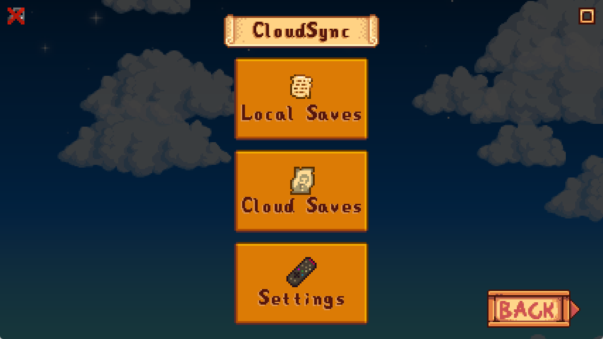
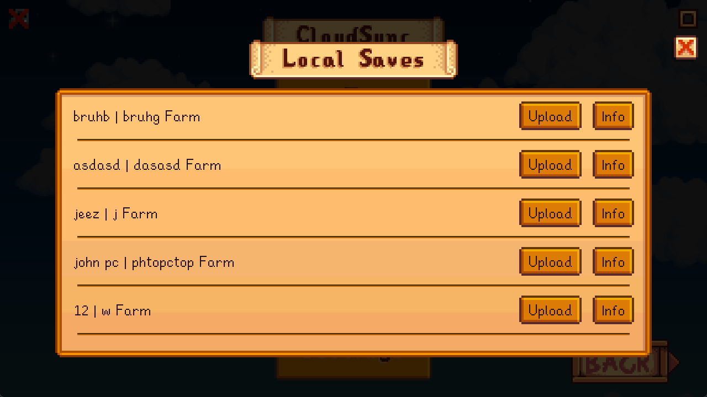
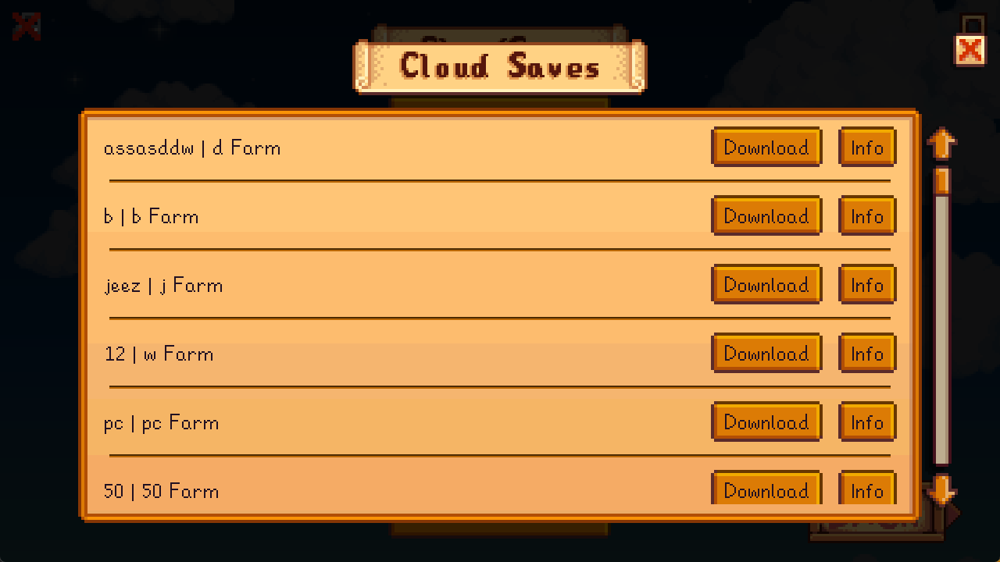
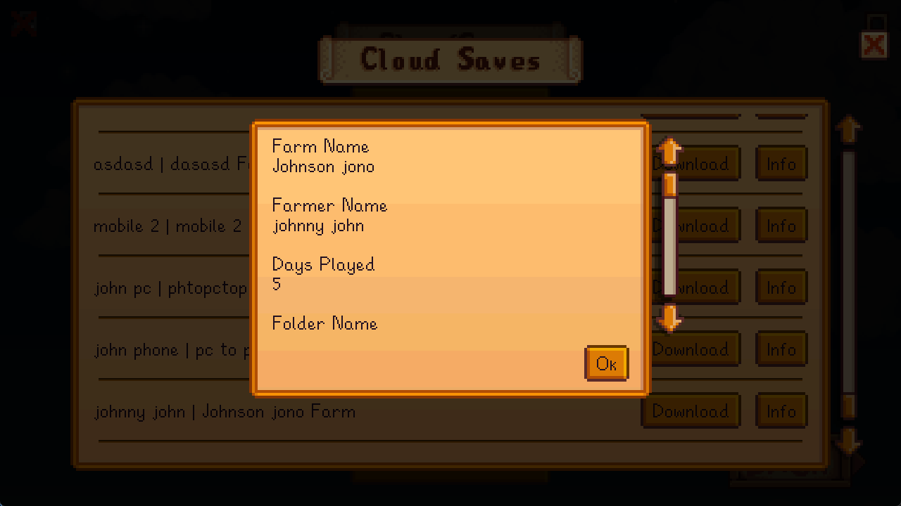
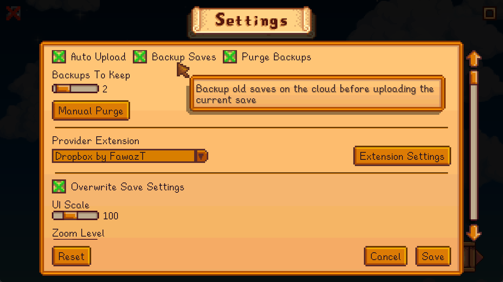
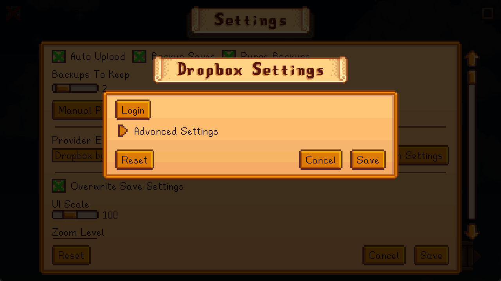

# CloudSync
CloudSync is a Stardew Valley mod that allows you to sync your saves across multiple devices using cloud storage services like Dropbox, and Google Drive.

[Nexus Page](https://www.nexusmods.com/stardewvalley/mods/33421)
<br/>
[Mobile App](https://github.com/FawazTakahji/CloudSync-Mobile)

## Installation
1. Install [SMAPI](https://smapi.io)
2. Download focustense's [StardewUI](https://github.com/focustense/StardewUI) mod
3. Download the main mod and a cloud provider extension from [Releases](https://github.com/FawazTakahji/CloudSync/releases)
4. Optionally, download [Global Config Settings Rewrite](https://github.com/FawazTakahji/GlobalConfigSettingsRewrite) to preserve your settings

## Features
- Upload saves to cloud storage services
- Download saves from cloud storage services
- Backup your saves when uploading
- Automatically upload your save after sleeping
- Get a warning if an existing save has more progress when uploading or downloading
- Support for adding your own cloud storage service using a [custom extension](https://github.com/FawazTakahji/CloudSync/tree/main/ExampleExtension) mod

## FAQ
### My settings keep getting reset
When transferring the save between pc and mobile the pc settings will get reset, to solve this issue you should download the [Global Config Settings Rewrite](https://github.com/FawazTakahji/GlobalConfigSettingsRewrite) mod and enable the Apply on load option

## Todo
- Add support for other cloud storage services

## Translations
| Language | Status | Translators |
| --- | --- | --- |
| Chinese | Partial | [1499935287](https://github.com/1499935287) |

## Screenshots
<details>
  <summary>Home Menu</summary>

  
</details>
<details>
  <summary>Local Saves Menu</summary>

  
</details>
<details>
  <summary>Cloud Saves Menu</summary>

  
</details>
<details>
  <summary>Save Info</summary>

  
</details>
<details>
  <summary>Settings Menu</summary>

  
</details>
<details>
  <summary>Extension Settings</summary>

  
</details>
<details>
  <summary>Upload In Progress</summary>

  
</details>

## Building
The mod build package should be able to locate your game folder automatically, if it cant find it or if you want to specify it manually, edit the csproj file like so:
```xml
<PropertyGroup>
    ...
    <GamePath>Your Game Path</GamePath>
    ...
</PropertyGroup>
```
If you want to set this path for all projects, create a file called `stardewvalley.targets` in your home folder (`%userprofile%` | `~`) and add the following:
```xml
<Project>
   <PropertyGroup>
      <GamePath>Your Game Path</GamePath>
   </PropertyGroup>
</Project>
```

You should now be able to build and debug the mod using your IDE
